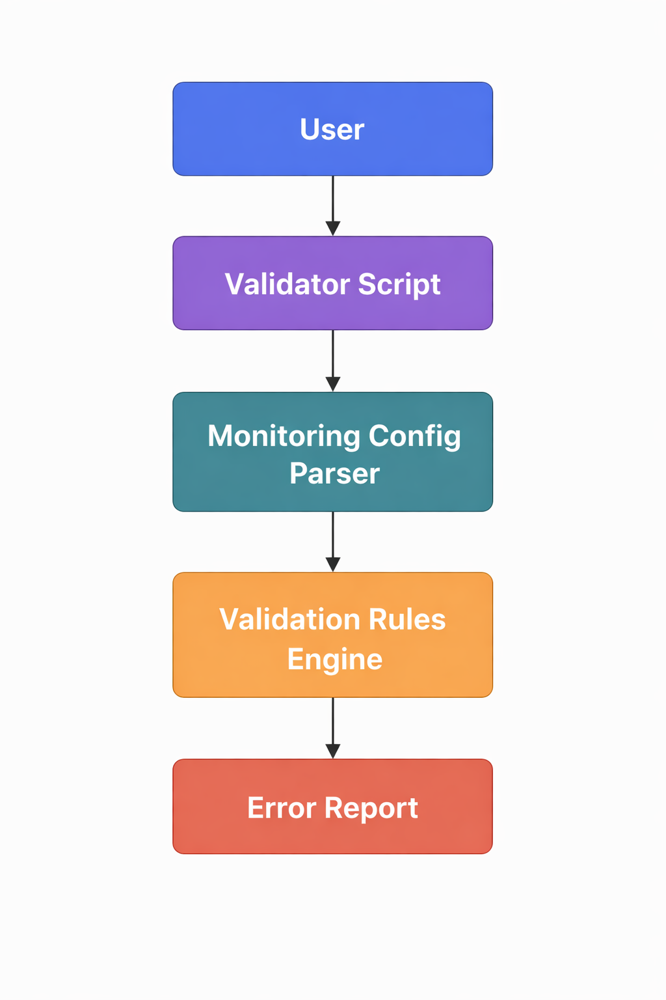

# Monitoring Configuration Validator


Student Name: Anwesha Jain  
Registration No: 23FE10CSE00795  
Course: CSE3253 DevOps [PE6]  
Semester: VI (2025–2026)  
Project Type: Puppet & Monitoring  
Difficulty: Intermediate  

---

# Project Overview

Monitoring Configuration Validator is a DevOps utility designed to automatically validate monitoring configuration files before deployment.

Monitoring systems rely heavily on configuration files. Incorrect configurations may cause:

- Missed alerts
- False alerts
- Monitoring failures
- Delayed incident response

This project introduces an automated validation mechanism that scans configuration files and detects potential errors before deployment.

---

# Problem Statement

Monitoring systems are critical for system reliability. However, monitoring configurations are often written manually and deployed without validation. A small syntax error or misconfiguration can lead to monitoring failures or missed alerts.

This project solves that problem by implementing a **Monitoring Configuration Validator** that checks configuration files and identifies potential issues automatically.

---

# Objectives

- Validate monitoring configuration files automatically
- Detect syntax errors in monitoring configurations
- Identify missing parameters
- Integrate validation into CI/CD pipelines
- Improve reliability of monitoring systems

---

# Key Features

- Monitoring configuration validation
- Error detection and reporting
- CI/CD integration
- Docker containerization
- Infrastructure configuration examples
- Automated testing

---

# Technology Stack

## Core Technologies

Programming Language: Python  
Configuration Format: YAML / JSON / CFG  

## DevOps Tools

Version Control: Git  
CI/CD: GitHub Actions  
Containerization: Docker  
Orchestration: Kubernetes  
Configuration Management: Puppet  
Monitoring Config Examples: Nagios style configs  

---

## Project Structure

```
devops-project-monitoring-config-validator
│
├── src
│   ├── main
│   │   └── validator.py
│   ├── config
│   │   └── config.yaml
│   └── scripts
│
├── docs
│   ├── architecture
│   │   └── architecture-diagram.png
│   ├── screenshots
│   ├── apidocumentation.md
│   ├── design-document.md
│   ├── projectplan.md
│   └── user-guide.md
│
├── infrastructure
│   ├── docker
│   │   ├── Dockerfile
│   │   └── docker-compose.yml
│   ├── kubernetes
│   │   ├── deployment.yaml
│   │   ├── service.yaml
│   │   └── configmap.yaml
│   ├── puppet
│   │   └── monitoring_validator.pp
│   └── terraform
│
├── monitoring
│   ├── alerts
│   │   └── cpu_alert.yml
│   ├── dashboards
│   │   └── sample_dashboard.json
│   └── nagios
│       └── sample_host.cfg
│
├── tests
│   ├── unit
│   │   └── test_dummy.py
│   ├── integration
│   ├── selenium
│   └── testdata
│
├── pipelines
│
├── presentations
│   └── demoscript.md
│
├── deliverables
│   ├── demovideo.mp4
│   ├── finalreport.pdf
│   └── assessment
│
├── .github
│   └── workflows
│       └── cicd.yml
│
├── README.md
├── LICENSE
└── requirements.txt
```

# Installation

Clone the repository
git clone https://github.com/anwesha067/devops-project-monitoring-config-validator.git

Navigate to the project directory
cd devops-project-monitoring-config-validator

Install dependencies
pip install -r requirements.txt

---

# Running the Validator

Run the monitoring configuration validator
python src/main/validator.py

The validator scans monitoring configuration files and reports any detected issues.

---

# CI/CD Pipeline

This project uses **GitHub Actions** for Continuous Integration.

Pipeline stages include:

- Checkout repository
- Install dependencies
- Run lint checks
- Run automated tests
- Build Docker image

Pipeline status can be viewed in the **GitHub Actions tab**.

---

# Docker Setup

Build Docker image
docker build -t monitoring-config-validator .

Run the container
docker run monitoring-config-validator

---

# Kubernetes Deployment

Apply Kubernetes manifests
kubectl apply -f infrastructure/kubernetes/

Check deployment status
kubectl get pods

---

# Testing

Run tests
pytest tests/

Test types:

- Unit Tests
- Integration Tests
- Test Data Validation

---

# Monitoring Configuration Examples

Example monitoring configurations are included:

- Nagios host configuration
- Alert rule definitions
- Monitoring dashboard configuration

These are located in the **monitoring/** directory.

---

# Architecture Diagram



Architecture Flow

User → Validator Script → Config Parser → Validation Engine → Error Report

---

# Security Measures

- Input validation
- Configuration file verification
- CI pipeline checks

---

# Development Workflow

Branching strategy
main
├── develop
│ ├── feature/validator-improvement
│ ├── feature/config-parser
│ └── hotfix/config-fix

Commit conventions

- feat: new feature
- fix: bug fix
- docs: documentation
- test: testing updates
- refactor: code improvement

---

# Project Challenges

- Designing validation rules for different configuration formats
- Integrating DevOps tools such as CI/CD pipelines
- Ensuring compatibility across monitoring systems

---

# Learnings

- DevOps automation practices
- CI/CD pipeline implementation
- Docker containerization
- Infrastructure as Code
- Monitoring configuration management

---

# Future Improvements

- Support additional monitoring platforms
- Add advanced rule-based validation
- Integrate with cloud monitoring tools
- Automate deployment pipelines

---

# Acknowledgments

Course Instructor: Mr. Jay Shankar Sharma

Open source tools and documentation were used as references.

---

# Contact

Student: Anwesha Jain  
GitHub: https://github.com/anwesha067

